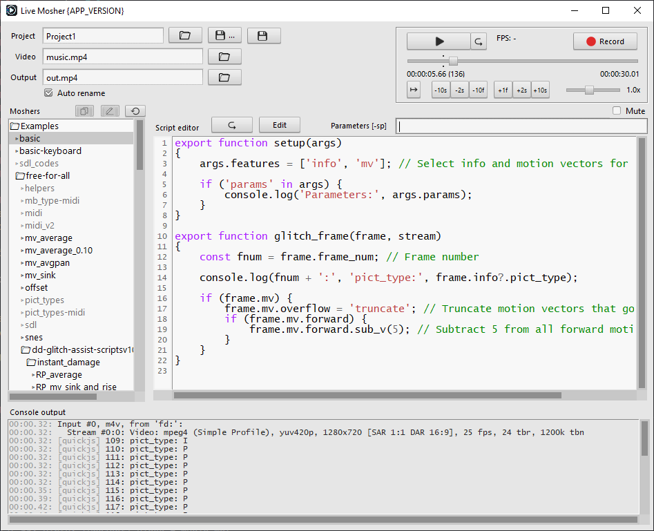

<h1 align="center"> Live Mosher </h1>  

    

    Welcome to Live Mosher, 
    a front-end for <a href="https://github.com/ramiropolla/ffglitch-core">FFglitch</a> made by ramiropolla.

All example scripts come from the [ffglitch-scripts](https://github.com/ramiropolla/ffglitch-scripts) repository by ramiropolla.

Full FFglitch documentation: [ffglitch.org/docs](https://ffglitch.org/docs/)

# Installation
Download and extract from [Releases](https://github.com/pawelzwronek/LiveMosher/releases)

# Running from source
1. Prepare virtual enviroment (Optional)
   - once

     `venv-prepare.cmd` (Windows)

     `venv-prepare.sh` (Linux, Mac)

   - at new terminal session

     `venv-win\Scripts\activate.bat` (Windows)

     `source venv-linux/bin/activate` (Linux)

     `source venv-mac/bin/activate` (Mac)

2. Install requirements (once)

    `pip install -r requirements-win.txt` (Windows)

    `pip3 install -r requirements-linux.txt` (Linux)

    `pip3 install -r requirements-mac.txt` (Mac)

3. Run the app

    `python src/LiveMosherApp.py` or `python3 src/LiveMosherApp.py`

# Build
Minimum Python version: 3.8

Tested on Windows 10, Ubuntu 20.04.6, and macOS Monterey 12

Have `python` (Windows) or `python3` installed. Building must take place on the targeted system, so on Windows for Windows, Linux for Linux, and macOS for Mac.
## Windows
 - run `venv-prepare.cmd` once
 - run `run_pyinstaller-win.cmd` to build from the source code
 - see `dist/win` for the executable

## Linux
 - install required packages: `sudo apt install binutils python3-venv python3-tk`
 - run `venv-prepare.sh` once
 - run `run_pyinstaller-linux.sh` to build from the source code for Linux
 - see `dist/linux` for the executable

## Mac
 - run `venv-prepare.sh` once
 - run `run_pyinstaller-mac.sh` to build from the source code for Mac
 - see `dist/mac` for the executable

All binaries in the `bin` folder come from my custom [FFGlitch-core build](https://github.com/pawelzwronek/ffglitch-core).

Have fun!
